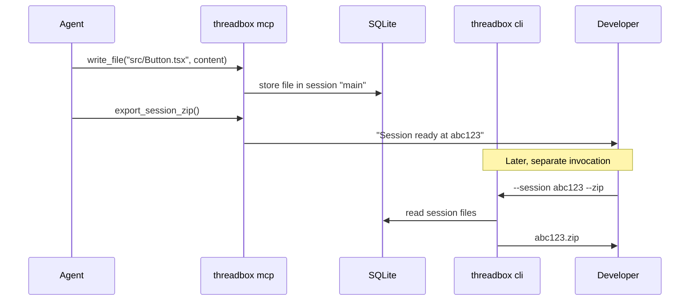

# ThreadBox

**A virtual file system for agent artefacts**

ThreadBox is an MCP server that provides AI agents with a sandboxed, versioned filesystem—automatically organized by Git worktree so concurrent agents never interfere.

- **Virtual filesystem**: Agents create, edit, and manage files in a sandboxed environment
- **Git-worktree aware**: Each worktree gets isolated sessions automatically
- **Immutable storage**: Full history of every edit, rename, and overwrite in append-only storage

When you're juggling multiple Git worktrees, your AI agents shouldn't collide. ThreadBox isolates sessions automatically—each worktree gets its own session namespace, keeping agent files separate without any configuration.



### Benefits

- **Concurrent isolation**: Run agents in parallel on different branches without file conflicts
- **Single storage location**: All sessions, files, and history in one SQLite database
- **Full version history**: Every change is preserved—recover previous versions or debug agent behavior

---

## Quick Start

```bash
# Build from source
git clone https://github.com/simbo1905/threadbox-mcp
cd threadbox-mcp
dart compile exe bin/threadbox.dart -o threadbox

# Add to Claude Desktop
# ~/.config/claude-desktop/config.json
{
  "mcpServers": {
    "threadbox": {
      "command": "/path/to/threadbox",
      "args": ["--mcp-server"]
    }
  }
}

# Start chatting—Claude can now create files in a sandbox
```

---

## How It Works

### Session Isolation

ThreadBox uses your Git worktree name as the session ID, but stores all data centrally:

```bash
# In main branch
~/project$ threadbox --mcp-server
# Session ID: "main"
# Data stored in: $HOME/.threadbox/data/threadbox.db

# In worktree
~/project-feature$ threadbox --mcp-server  
# Session ID: "feature-branch"
# Data stored in: $HOME/.threadbox/data/threadbox.db

# Both run simultaneously—sessions isolated in same DB
# Deleting a worktree doesn't lose the VFS data
```

**No Git?** Uses "default" session ID.

### Data Storage

ThreadBox stores everything in a single SQLite database:

- **Default location**: `$HOME/.threadbox/data/threadbox.db`
- **Override**: `threadbox --mcp-server --data-path /path/to/custom/`

```bash
# Example structure
$HOME/.threadbox/
└── data/
    └── threadbox.db     # All sessions, inodes, file content
```

---

## CLI Usage

```bash
# Export session as zip
threadbox --session abc123 --zip
# Creates: threadbox-session-abc123-2024-01-15.zip

# Override data path for this command
threadbox --session abc123 --zip --data-path /tmp/threadbox

# Debug: dump all session state
threadbox --dump
```

---

## MCP Tools

### `write_file`

```typescript
{
  "sessionId": "xyz",  // Optional, auto-detected from Git worktree
  "path": "src/Button.tsx",
  "content": "export const Button = () => <button>Click</button>",
  "base64": false
}
```

**Returns**: `{ "inodeId": "uuid", "version": 1 }`

### `read_file`

```typescript
{
  "sessionId": "xyz",  // Optional, auto-detected from Git worktree
  "path": "src/Button.tsx"
}
```

**Returns**: `{ "content": "...", "base64": false, "version": 1, "inodeId": "uuid" }`

### `list_directory`

```typescript
{
  "sessionId": "xyz",  // Optional, auto-detected from Git worktree
  "path": "src"
}
```

**Returns**: 
```json
{
  "directories": ["components", "hooks"],
  "files": ["index.ts", "types.ts"]
}
```

### `export_session_zip`

```typescript
{
  "sessionId": "xyz"  // Optional, auto-detected from Git worktree
}
```

**Returns**: `{ "downloadPath": "/path/to/threadbox-session-xyz-2025-01-15.zip" }`

---

## Development

```bash
# Install dependencies
dart pub get

# Run tests
dart test

# Build
dart compile exe bin/threadbox.dart -o threadbox
```

---

## Architecture

- **Storage**: SQLite with `sqlite_async` for concurrent access
- **Session Management**: Git worktree auto-detection
- **Versioning**: Append-only immutable storage with full history
- **Transport**: JSON-RPC 2.0 over stdio (MCP protocol)

---

## License

MIT

---

**Alpha Status**: Pre-1.0; APIs and storage may change.
